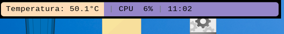

# Polybar customizada para Raspberry

Probado en Raspbian 12 que esta basado en Debian 12 (bookworm)
 
La barra sigue en desarrollo pues por el momento solo muestra la hora, el Nombre de la ventana en que se esta trabjando (limitado a 10 caracteres),  el % de uso de CPU y la Temperatura de la CPU

 
El icono del escritorio es un archivo llamado polybar.desktop que necesita editarse para agregar la ruta al polybar-icon.png
 
Se recomienda poner el png del icono en la carpeta /home/usuario/Public/polybar-icon.png para que este "oculto".

